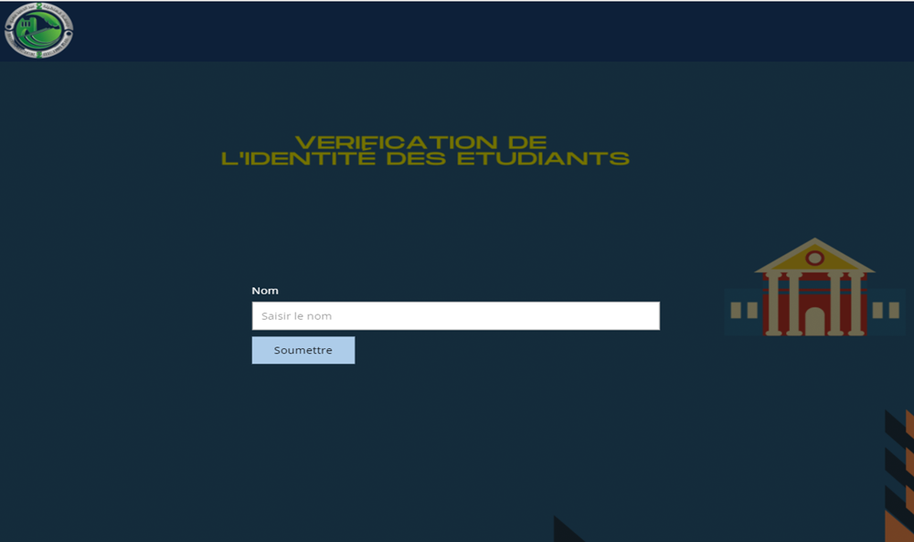

# UniversityManagement-ServiceWeb-SOAP

## Project Description

This project is a student identity verification system for a university. It is composed of two web applications:

- **University Application**: This application has a server and database for students informations management and provides SOAP web services for the garde application.
- **Garde Application**: This application uses the SOAP web services provided by the university application to verify student identities.

## Technologies Used

The following technologies are used in this project:

- Java
- HTML
- CSS
- SOAP
- Axis2
- PostgreSQL
- Hibernate

## Setup and Installation

To set up and install this project, follow these steps:

1. Clone the project repository to your local machine.
2. Open the project in your preferred IDE.
3. Run the `mvn clean install` command to build the project.
4. Create a database called `University` in PostgreSQL.
5. Add the PostgreSQL driver and Hibernate to your project's dependencies.
6. Change the username and password of the SGBD in the `hibernate.cfg.xml` file and the `Connexion` class in the University-Management application.
7. Start the University Application by deploying it to an Apache Tomcat server.
8. Start the Garde Application by deploying it to a different Apache Tomcat server with a different port .

## Usage

To use this project, follow these steps:

1. Open a web browser and navigate to the University Application URL.
2. Enter the username and password for a university administrator and click the "Login" button.
3. Click on the "Students" tab.
4. Enter the matricule or name and first name of the student you want to verify and click the "Search" button.
5. The student's information will be displayed on the screen.

## Some Pictures

  
Admin Index Page

  

  
Garde Index Page

  

  
Student Management

  

  
Garde Result

  

  
Search by Name

  

## Contributing

If you would like to contribute to this project, please follow these steps:

1. Fork the project repository to your own GitHub account.
2. Create a new branch for your changes.
3. Make your changes and commit them to your branch.
4. Push your changes to your forked repository.
5. Create a pull request to the main repository.

## License

This project is licensed under the MIT license.

## Contact

If you have any questions or comments about this project, please feel free to contact me at [mahrougnazim@gmail.com]

